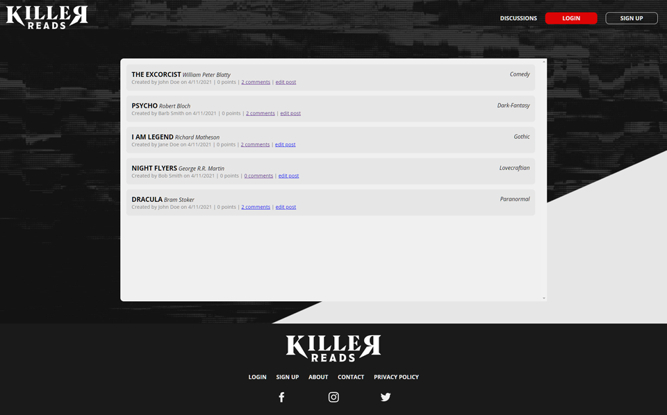
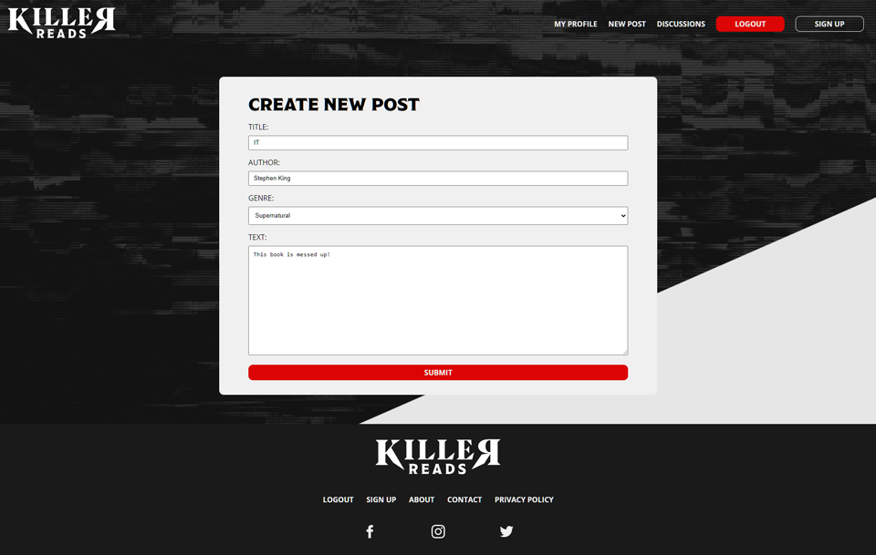

# Killer Reads

## Table of Contents
* [Description](#description)
* [Deployed Application](#deployed)
* [The Challenge](#challenge)
* [Cloudflare Workers Setup](#cf-setup)
* [Architecture Notes](#architecture)
* [Contributors](#contributors)

## Description <a name="description"></a>
An online book club platform catering to the horror community. Create posts, leave comments, and discover all new stories from a community of horror book lovers.





## Deployed Application <a name="deployed"></a>
Originally deployed on Heroku; this branch migrates the app to Cloudflare Workers + D1 (see below). Update this link once you deploy your own copy with `wrangler deploy`.

## The Challenge <a name="challenge"></a>
AS A bookworm that loves the horror genre
I WANT a place online to discuss books
SO THAT I can find new books to read while always gaining deeper understanding of my favorite books

## Cloudflare Workers Setup <a name="cf-setup"></a>

This app runs on Cloudflare Workers with a D1 (SQLite) database, R2 for image
uploads, and static assets served straight from `public/`. Everything is
plain JavaScript (no build step beyond precompiling the existing Handlebars
views — see [Architecture Notes](#architecture)).

### 1. Install dependencies

```
npm install
```

### 2. Create the D1 database

```
wrangler d1 create killer-reads-db
```

This prints a `database_id`. Copy it into `wrangler.toml`, replacing the
`REPLACE_WITH_YOUR_DATABASE_ID` placeholder under `[[d1_databases]]`.

### 3. Create the R2 bucket (for image uploads)

```
wrangler r2 bucket create killer-reads-images
```

### 4. Set secrets

```
wrangler secret put SESSION_SECRET
wrangler secret put SENDGRID_API_KEY
```

* `SESSION_SECRET` — any long random string; used to sign the session-id cookie. Required.
* `SENDGRID_API_KEY` — your SendGrid API key, used for the "forgot password" email. Optional — if omitted, the app logs the reset link to the console instead of emailing it (handy for local testing).

For **local development**, wrangler doesn't read `wrangler secret put` values —
create a `.dev.vars` file instead (already gitignored):

```
SESSION_SECRET=some-long-random-local-only-string
SENDGRID_API_KEY=
```

### 5. Run migrations

```
npm run db:migrate:local     # local dev database (used by `wrangler dev`)
npm run db:migrate:remote    # real Cloudflare D1 database (used by `wrangler deploy`)
```

### 6. Seed sample data (optional but recommended)

```
npm run db:seed:local
npm run db:seed:remote
```

`seed.sql` is a plain-SQL port of the original `seeds/*.js` fixtures. All
seeded users share the password `password123` (bcrypt hash baked into the
file — regenerate it with
`node -e "require('bcryptjs').hash('password123', 10).then(console.log)"`
if you want a different one).

### 7. Run locally

```
npm run dev
```

This starts `wrangler dev` against the **local** D1/R2 simulators (no
Cloudflare account calls). Visit http://localhost:8787.

### 8. Deploy

```
npm run deploy
```

Runs `wrangler deploy`, which builds against your **remote** D1/R2 resources.
Make sure you've run the `--remote` migrate/seed commands above at least once
first.

## Architecture Notes <a name="architecture"></a>

What changed from the original Heroku/Express app, and why:

* **Express → Hono.** Express's `app.listen()` server model can't run on the
  Workers runtime (no Node HTTP server, no persistent process), so the router
  had to change. Hono is a thin, Workers-native router with an API similar
  enough to Express that `controllers/*.js` ports over almost line-for-line
  into `src/routes/*.js`.
* **Views stayed Handlebars.** The original `views/*.handlebars` files,
  `views/partials/*.handlebars`, and `utils/helpers.js` (renamed
  `utils/helpers.cjs` — see below) are unchanged. They're rendered with the
  real `handlebars` npm package instead of the Express-only
  `express-handlebars` middleware.
  * **Why a precompile step:** Cloudflare Workers blocks dynamic code
    generation (`eval`/`new Function`) for security, and `Handlebars.compile()`
    relies on exactly that. So `scripts/build-templates.mjs` precompiles every
    `.handlebars` file into plain JS (`src/generated/templates.js`, gitignored)
    ahead of time, and the Worker renders them with the eval-free
    `handlebars/runtime` build. This runs automatically before `npm run dev`
    and `npm run deploy` (see the `predev`/`predeploy` scripts) — if you edit
    a `.handlebars` file, just re-run `npm run dev`/`deploy`, or
    `npm run build:templates` manually.
  * `utils/helpers.js` was renamed to `utils/helpers.cjs` (content byte-for-byte
    identical). This is required because `package.json` now sets
    `"type": "module"` for the Worker's own ESM code, and Node/esbuild only
    treat `.cjs` files as CommonJS unconditionally regardless of that setting
    — the file still uses the original `module.exports`/`require('crypto')`.
  * `utils/auth.js` (the old `withAuth` Express middleware) is kept for
    reference but isn't imported anywhere — Express's `(req, res, next)`
    signature doesn't exist in Hono. The equivalent guard is
    `requireAuth()` in `src/lib/session.js`, same behavior (redirects to
    `/login` if there's no session).
* **Sequelize/MySQL → Drizzle/D1.** `models/*.js` became
  `src/db/schema.js`, keeping the same table names, columns, and
  relationships (including the same `snake_case` field names Sequelize used,
  e.g. `post_text`, `created_at`, `genre_id`), so the Handlebars templates
  didn't need to change at all. Migrations live in `migrations/` (generated
  with `drizzle-kit generate`); `seed.sql` replaces `seeds/*.js`.
  * **Fix:** the original `comment`/`vote` foreign keys to `post` had no
    cascade behavior, so deleting a post with any comments or votes always
    failed with a foreign-key error (same bug existed under MySQL). Both now
    cascade-delete on post deletion.
  * **Fix:** `seeds/vote-seeds.js` inserted `{user_id, genre_id}` pairs, but
    the `Vote` model requires `{user_id, post_id}` (`post_id` `NOT NULL`) —
    that seed was already broken upstream. `seed.sql` uses sensible
    `{user_id, post_id}` pairs instead.
* **express-session + connect-session-sequelize → signed cookie + D1
  `session` table.** The signed HTTP-only cookie holds only an opaque
  session id (via Hono's `hono/cookie` helpers); the row in D1 holds
  `user_id`/`username`/`email` and an expiry. This was chosen over a
  cookie that carries the session payload directly because it makes
  `/api/users/logout` an actual server-side revocation (delete the row) —
  a payload-only signed cookie can't be invalidated before it expires.
* **bcrypt → bcryptjs.** `bcrypt` is a native (C++) addon; Workers only run
  pure JavaScript/WASM. `bcryptjs` is a drop-in, pure-JS reimplementation, so
  existing password hashes and the hashing calls didn't need to change
  otherwise.
* **express-fileupload → R2.** Uploaded images go to the `IMAGES_BUCKET` R2
  bucket (`wrangler r2 bucket create killer-reads-images`) instead of
  `public/assets/uploads/`; a `GET /uploads/:key` route in `src/index.js`
  proxies objects back out of R2. The `image` table keeps the same metadata
  columns, swapping the old `data` BLOB column for an `r2_key`.
* **SendGrid** is unchanged apart from calling the HTTP API directly via
  `fetch()` (`src/lib/email.js`) instead of the `@sendgrid/mail` SDK, and
  reading the key from `env.SENDGRID_API_KEY` (a Workers secret) instead of
  `process.env`.
* **Heroku artifacts removed:** the `JAWSDB_URL`/`dotenv`-based
  `config/connection.js` is gone (D1 is bound directly via `wrangler.toml`);
  there was no `Procfile` or `.env` in the repo to begin with.
* **Small security fixes** made along the way (all pre-existing bugs in the
  original app, not intentional behavior changes):
  * `PUT /api/users/:id` and `DELETE /api/users/:id` had no auth check at
    all in the original app; they now require a session and only allow a
    user to modify their own account, matching what `PUT /api/posts/:id`
    already did.
  * `DELETE /api/posts/:id` didn't check ownership (any logged-in user could
    delete anyone's post); it now matches the ownership check `PUT` already
    had.
  * Signup/login responses no longer include the bcrypt password hash in
    the JSON body.
* **Dropped as dead/broken code**, not ported: `controllers/auth-routes.js`
  (an unreachable duplicate of `home-routes.js`'s login/signup pages —
  `home-routes` was always registered first) and the standalone `GET
  /edit-post` route (redirected to itself when logged in — an infinite
  redirect bug; the real edit flow is `/user-profile/edit-post/:id`).

## Contributors <a name="contributors"></a>
* [Melanie Arnold](https://github.com/einalem4)
* [Rick Hill](https://github.com/rickhill543)
* [Ian Jackson](https://github.com/ijacksondesign)
* [Tyler Razer](https://github.com/thrazer675)
